<div align="center">

# zhiran-AgentOS

### 取名知然 AgentOS。知其然，更要知其所以然。

基于AgentScope2.0开发，以Harness理念搭建的Agent核心，可视化配置Harness Agent。可快速接入企业业务需求。

[](#)
[](https://openjdk.org/projects/jdk/21/)
[](https://spring.io/projects/spring-boot)
[](https://github.com/agentscope-ai/agentscope-java)
[](https://vuejs.org/)
[](https://www.mysql.com/)

[项目简介](#项目简介) · [核心能力](#核心能力) · [产品预览](#产品预览) · [技术架构](#技术架构) · [快速开始](#快速开始)

</div>

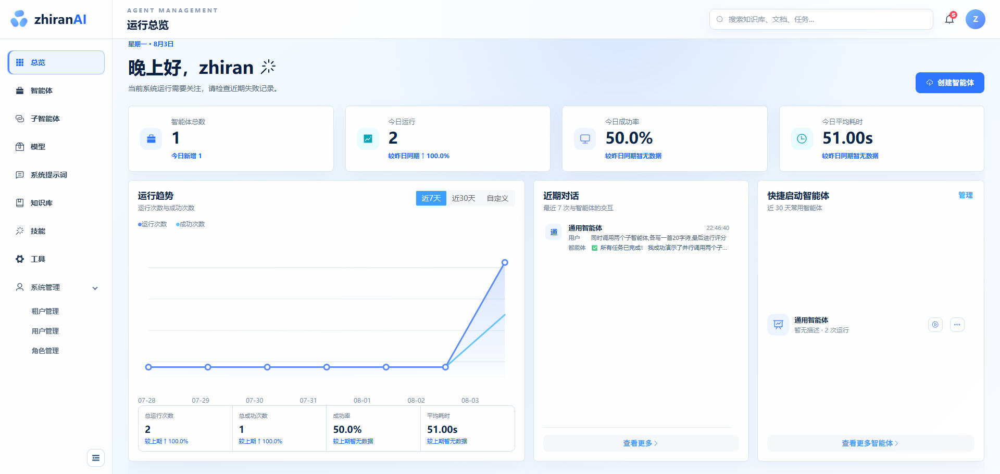

## 项目简介

**zhiran-AgentOS** 是一套基于 AgentScope2.0 Java 与 Spring Cloud 构建的企业级智能体管理平台，覆盖智能体从资源准备、可视化配置、在线调试到生产运行与审计分析的完整生命周期。

当 Agent 从演示走向真实业务，团队需要管理的不再只是一个模型 API，而是一整套持续演进的运行系统：模型连接、系统提示词、企业知识、技能说明、可执行工具、子智能体协作、权限策略、状态持久化与运行日志。zhiran-AgentOS 将这些能力沉淀为可独立治理、又能灵活组合的平台资源。

> **一句话总结：** 用可视化方式组装 Agent，用平台化方式治理能力，用可观测方式保障运行。

## 快速开始

### 环境要求

| 组件 | 建议版本 | 用途            |
| --- | --- |---------------|
| JDK | 21 | 后端运行环境        |
| Maven | 3.9+ | 后端构建          |
| Node.js | `^20.19.0` 或 `>=22.12.0` | 前端构建与运行       |
| MySQL | 8.x | 持久化数据存储       |
| Redis | 6.x / 7.x | 缓存与Agent上下文存储 |
| Nacos | 3.x | 服务注册、发现与配置    |
| 向量数据库 | Elasticsearch / Milvus / PostgreSQL + pgvector / Qdrant 四选一 | 知识库向量检索       |

### 1. 获取项目

```bash
git clone https://github.com/GIAFire/zhiran-agentOS
cd zhiran-agentOS
```

### 2. 初始化数据库

登录 MySQL 后执行：

```sql
CREATE DATABASE IF NOT EXISTS zhiran_agentos
  DEFAULT CHARACTER SET utf8mb4
  COLLATE utf8mb4_unicode_ci;

USE zhiran_agentos;
SOURCE docs/sql/zhiran_agentos.sql;
```

### 3. 修改本地配置

根据实际环境检查以下配置文件：

| 配置文件 | 需要关注的内容                           |
| --- |-----------------------------------|
| `auth/src/main/resources/application.yml` | Nacos、MySQL、Redis、JWT Secret      |
| `gateway/src/main/resources/application.yml` | Nacos、Redis、路由与 JWT Secret        |
| `service-modules/agent/src/main/resources/application.yml` | Nacos、MySQL、Redis、向量库(非必须)、知识文件目录 |

本地向量库可不配置，但也无法使用知识库功能，若要使用知识库，请配置service-modules/agent/src/main/resources/application.yml。可将 `rag.store.type` 修改为 `Elasticsearch`、`milvus`、`pgvector` 或 `qdrant`，并补充对应连接信息。

> 生产环境请务必修改示例数据库口令、Nacos 口令和 JWT Secret，并将 `knowledge.source.root` 指向所有 Agent 实例均可读写的共享目录。

### 4. 构建并启动后端

先在项目根目录安装所有模块：

```bash
mvn clean install -DskipTests
```

确认 MySQL、Redis、Nacos 以及所选向量数据库已启动后，分别打开终端启动三个服务：

```bash
mvn -f auth/pom.xml spring-boot:run
```

```bash
mvn -f service-modules/agent/pom.xml spring-boot:run
```

```bash
mvn -f gateway/pom.xml spring-boot:run
```

### 5. 启动前端

```bash
cd ui
npm install
npm run dev
```

浏览器访问：<http://localhost:5173>

初始化脚本内置开发账号：

```text
用户名：zhiran
密码：zhiran
```


### 默认服务端口

| 服务 | 端口 | 说明 |
| --- | ---: | --- |
| UI | 5173 | Vite 开发服务器，`/api` 代理至 Gateway |
| Gateway | 8081 | 平台统一 API 入口 |
| Auth | 8082 | 认证服务，上下文路径 `/auth` |
| Agent | 8100 | Agent 服务，上下文路径 `/agent` |

### 为什么选择 zhiran-AgentOS

| 特性            | 说明                                          |
|---------------|---------------------------------------------|
| **快速接入业务**    | 通过nacos发现Agent服务,业务系统可直接调用Agent服务,实现企业项目智能化 |
| **快速搭建Agent** | 五步创建向导完成基础信息、模型与提示词、能力、知识库及高级运行配置           |
| **多智能体协作**    | 支持本地 Agent 复用与远程 Agent 接入，完成多智能体协作          |
| **企业知识增强**    | 本地知识文档上传、解析、切片、向量化、检索形成完整 RAG 链路            |
| **权限安全**      | 工具与技能可根据不同用户角色配置权限                |
| **运行过程可见**    | 流式呈现响应、工具调用、执行计划与任务进度，支持随时停止运行              |
| **全链路日志**     | 汇总运行次数、成功率、耗时、Token，并保留模型、工具、技能与事件日志        |
| **企业级基础设施**   | 微服务架构、多租户、用户与角色、JWT 网关鉴权、Redis 与多数据源支持      |

## 核心能力

### 1. 智能体全生命周期管理

- 通过五步向导创建智能体：**基础信息 → 模型与提示词 → 能力配置 → 知识库 → 高级配置**。
- 按需绑定模型、系统提示词、工具、技能、子智能体与知识库，资源可跨 Agent 复用。
- 支持最大循环次数、长期记忆、大工具结果卸载、上下文压缩等运行策略。
- 内置 Plan Mode 与结构化任务列表，适合执行需要拆解、审批和持续跟踪的复杂任务。
- 会话状态可选择本地文件、Redis 或 MySQL，兼顾本地开发与分布式部署。

### 2. 多模型统一接入

- 支持 **OpenAI 兼容协议、DashScope、Anthropic、Ollama**。
- 统一管理 Base URL、API Key、自定义 Header、模型名称。
- 支持流式输出、思考模式、Temperature、Top P、最大 Token、超时与重试参数。
- 提供连接测试、调用次数、成功率、平均耗时、模型调用日志。

### 3. 多智能体协作与委派

- 将平台内已有 Agent 注册为本地子智能体，实现能力复用与分层编排。
- 通过远程 URL、Agent Protocol 与认证 Header 接入外部子智能体。
- 支持并行委派、任务状态跟踪、结果回收和异常监控。
- 对话工作区实时展示执行计划与各阶段完成状态，复杂任务进度一目了然。

### 4. 企业知识库与 RAG

- 支持 `PDF / DOC / DOCX / TXT / MD` 文档上传和后台处理。
- 支持按字符、按段落、按指定分隔符切片，并可配置切片长度与重叠区间。
- 提供文档处理状态、切片正文、页码、章节与 Token 信息查看。
- 支持独立 Embedding 模型、Top K、相似度阈值和 Agent 绑定。
- 向量存储可在 **Elasticsearch、Milvus、pgvector、Qdrant** 中选择。

### 5. Skill 技能管理

- 将稳定的方法论、操作规范和业务流程封装为可复用 Skill。
- 支持分类、标签、风险等级、可用角色与 Agent 绑定范围管理。
- 内置文件树与 `SKILL.md` 内容编辑器，可维护技能说明及资源文件。
- 记录真实使用次数、成功率、平均耗时、近期使用与异常记录。
- 支持 MySQL 技能仓库，并预留 Nacos 技能同步能力。

### 6. Tool 工具治理

- 运行时工具自动注册并同步至管理端，可按名称、编码和分类检索。
- 支持工具分组、租户开关、角色级权限规则与风险分级。
- 权限行为覆盖允许、拒绝、询问用户和继续匹配后续规则。
- 完整记录工具参数、权限判定、执行结果、耗时与异常，便于安全审计。

### 7. 可观测对话与运行分析

- 基于 SSE 提供流式对话，支持停止生成和会话历史管理。
- 结构化展示模型输出、运行事件、工具调用、子智能体任务与执行计划。
- 总览页聚合 Agent 数量、运行趋势、成功率、平均耗时与近期交互。
- Agent、模型、Skill、Tool 均提供独立指标和近期成功/失败记录。

### 8. 多租户与权限体系

- 提供租户、用户、角色和权限数据模型，业务数据按租户上下文隔离。
- Gateway 统一校验 JWT，并将用户上下文安全传递给下游服务。
- Tool 与 Skill 可按角色配置使用范围，子智能体可继承父 Agent 的权限限制。
- API 日志与 MDC 请求上下文便于跨服务排查问题。

## 产品预览

### 运行总览

集中查看智能体规模、今日运行、成功率、平均耗时、运行趋势、近期对话与常用 Agent。


### 智能体构建与运行

<table>
  <tr>
    <td width="50%" align="center"><strong>智能体管理</strong></td>
    <td width="50%" align="center"><strong>五步创建向导</strong></td>
  </tr>
  <tr>
    <td>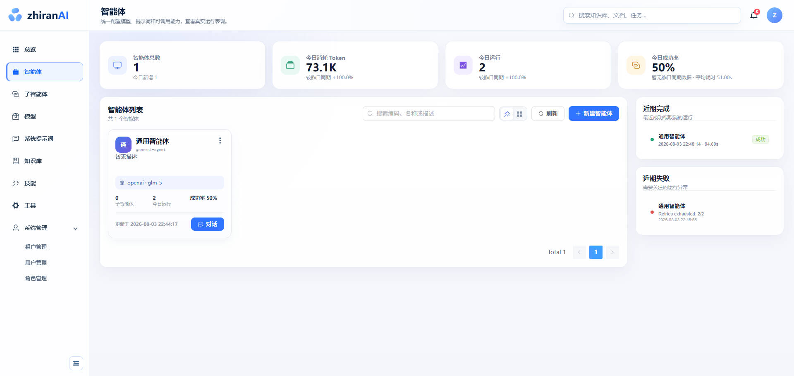</td>
    <td>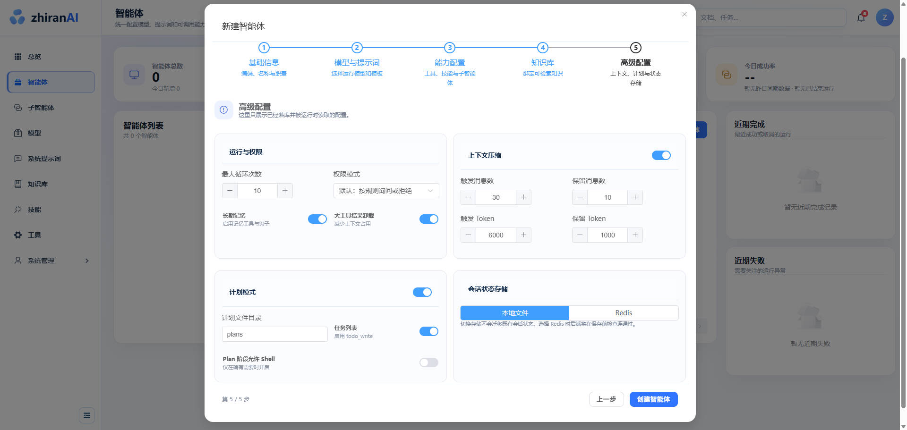</td>
  </tr>
  <tr>
    <td width="50%" align="center"><strong>执行计划与实时进度</strong></td>
    <td width="50%" align="center"><strong>多智能体协作结果</strong></td>
  </tr>
  <tr>
    <td>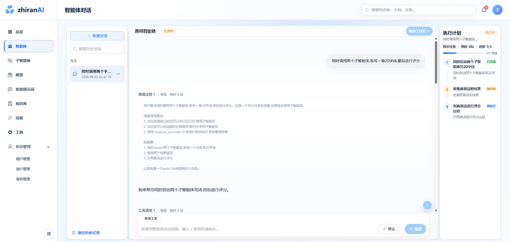</td>
    <td>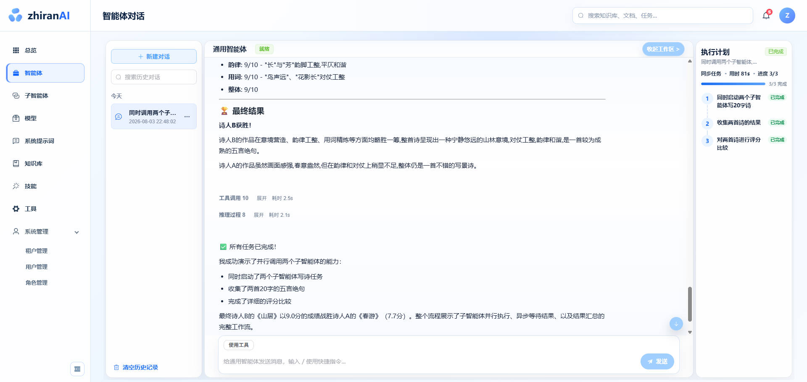</td>
  </tr>
</table>

### 子智能体协作

<table>
  <tr>
    <td width="50%" align="center"><strong>子智能体运行与委派监控</strong></td>
    <td width="50%" align="center"><strong>本地 / 远程子智能体接入</strong></td>
  </tr>
  <tr>
    <td>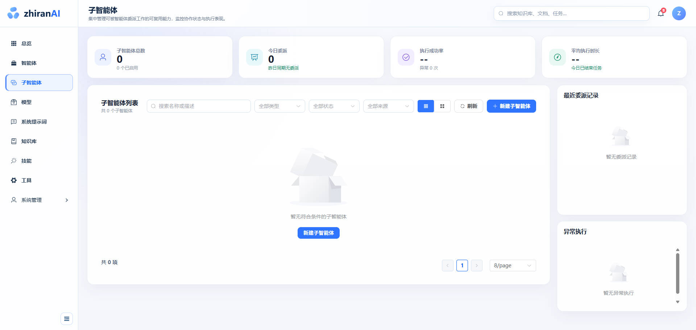</td>
    <td>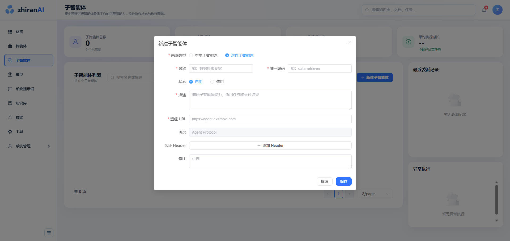</td>
  </tr>
</table>

### 模型与提示词资产

<table>
  <tr>
    <td width="50%" align="center"><strong>模型连接与调用分析</strong></td>
    <td width="50%" align="center"><strong>系统提示词统一管理</strong></td>
  </tr>
  <tr>
    <td>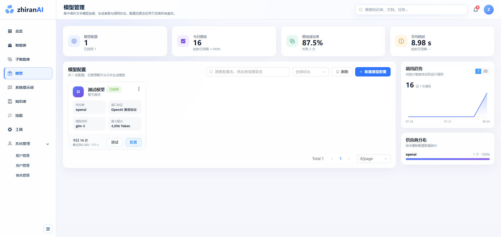</td>
    <td>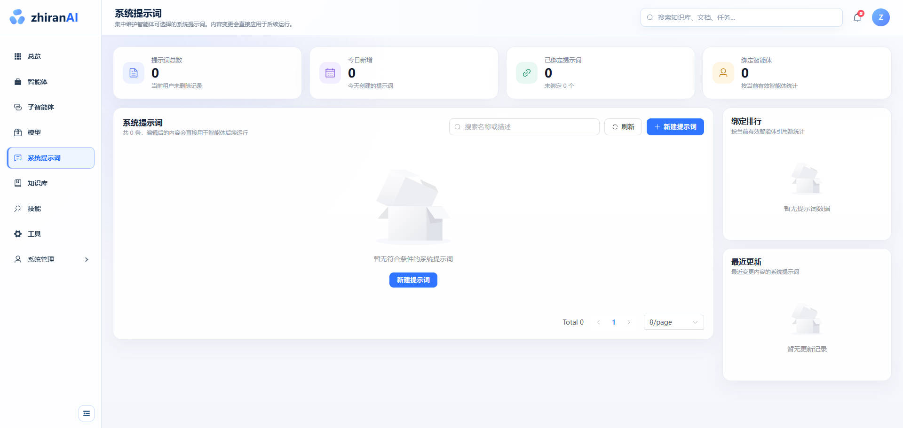</td>
  </tr>
  <tr>
    <td width="50%" align="center"><strong>模型参数与连接测试</strong></td>
    <td width="50%" align="center"><strong>提示词内容编辑</strong></td>
  </tr>
  <tr>
    <td>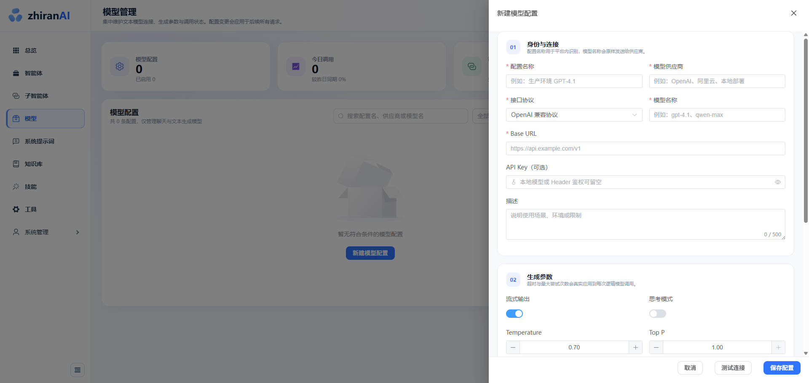</td>
    <td>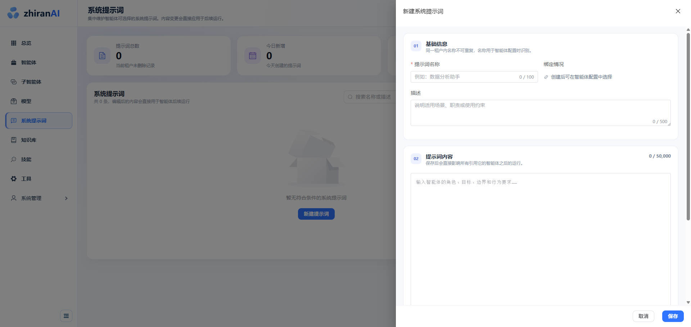</td>
  </tr>
</table>

### 企业知识库

<table>
  <tr>
    <td width="50%" align="center"><strong>知识库与检索配置</strong></td>
    <td width="50%" align="center"><strong>文档切片策略</strong></td>
  </tr>
  <tr>
    <td>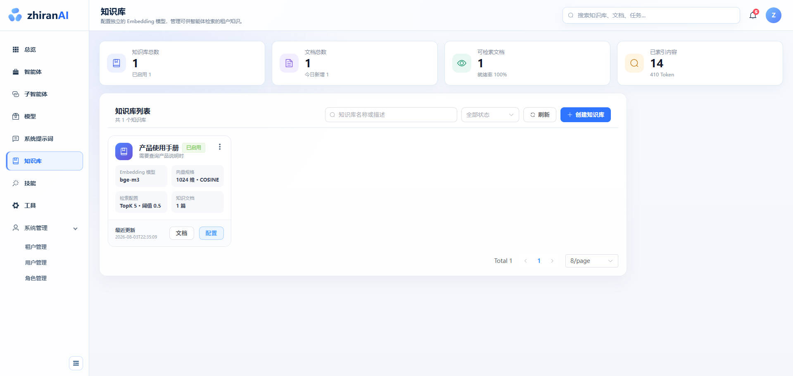</td>
    <td>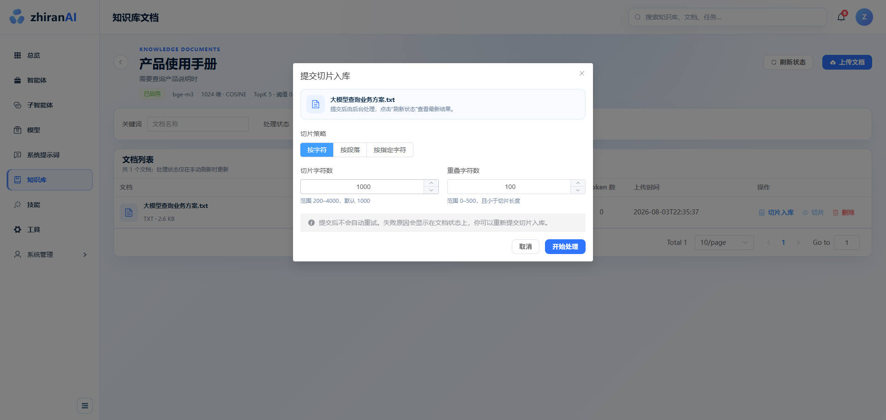</td>
  </tr>
</table>


  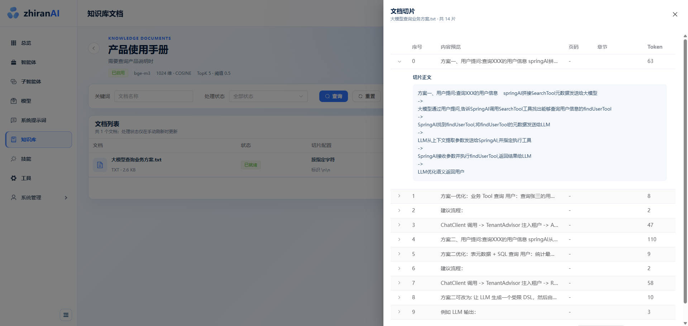


### 技能与工具治理

<table>
  <tr>
    <td width="50%" align="center"><strong>Skill 技能管理</strong></td>
    <td width="50%" align="center"><strong>SKILL.md 在线编辑</strong></td>
  </tr>
  <tr>
    <td>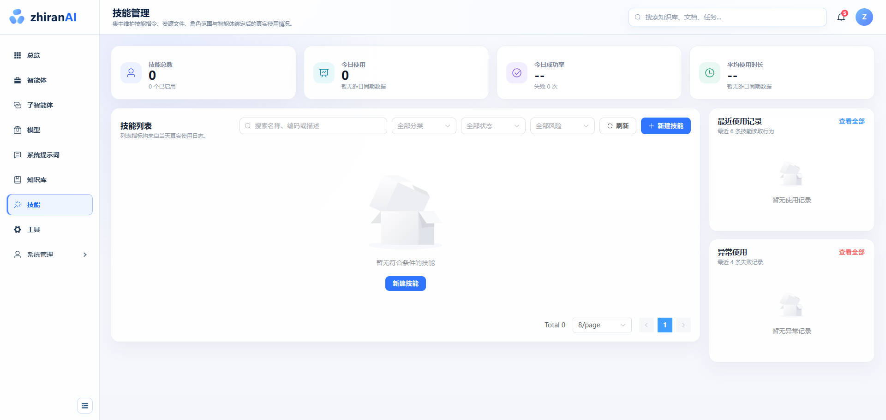</td>
    <td>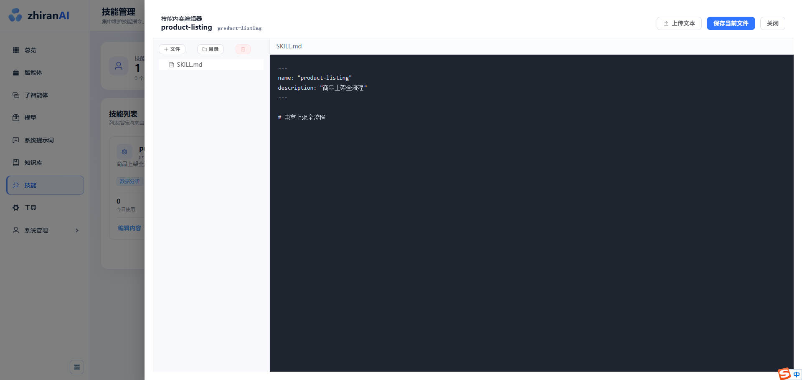</td>
  </tr>
  <tr>
    <td width="50%" align="center"><strong>Tool 工具注册与统计</strong></td>
    <td width="50%" align="center"><strong>角色级工具权限</strong></td>
  </tr>
  <tr>
    <td>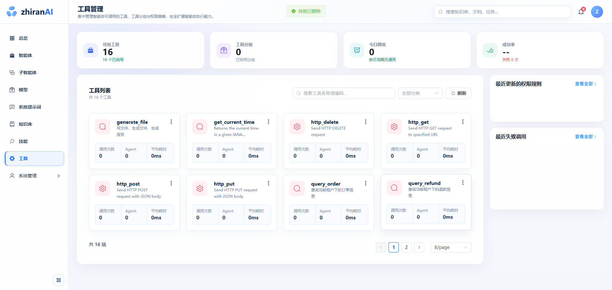</td>
    <td>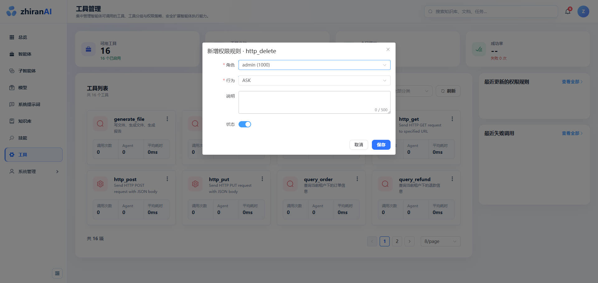</td>
  </tr>
</table>

### 系统管理

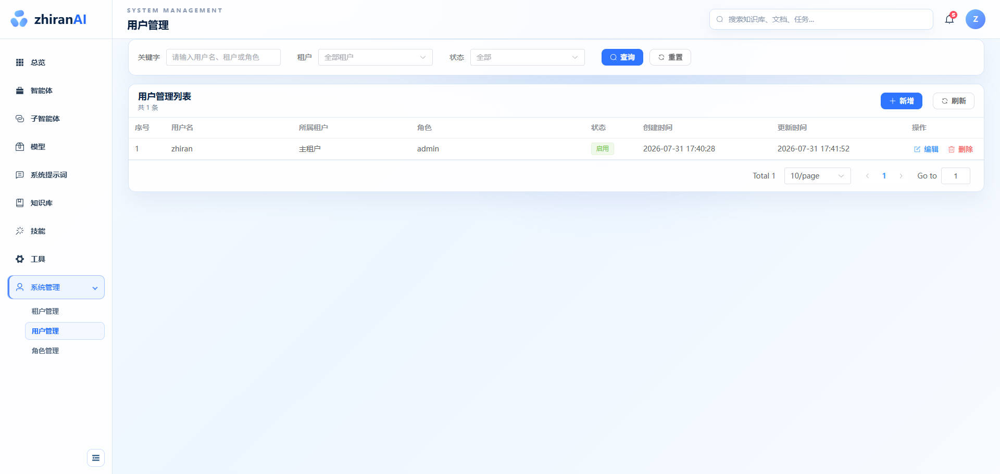

## 技术架构

```text
用户打开管理后台
        ↓
所有请求先经过 gateway 网关
        ↓
   ┌────┴────┐
登录认证服务   智能体服务
              ↓
       调用大模型、工具、技能、
       子智能体和企业知识库
              ↓
       MySQL / Redis 保存数据
```

### 请求链路

1. 前端请求统一进入 Gateway。
2. Gateway 校验 JWT，解析用户、租户和角色信息并传递给下游服务。
3. Auth Service 负责登录认证；Agent Service 负责资源管理、运行编排和审计。
4. AgentRuntimeFactory 将模型、提示词、知识、工具、Skill、Subagent、权限与状态存储组装为可运行的 Harness Agent。
5. 运行事件通过 SSE 返回前端，并同步沉淀到会话、消息、计划、工具调用和模型调用日志。

## 技术栈

| 层级       | 技术选型 | 版本 / 说明 |
|----------| --- | --- |
| 开发语言     | Java | 21 |
| Agent 框架 | AgentScope Java | 2.0.0，Harness Agent |
| 基础框架     | Spring Boot | 4.0.6 |
| 微服务      | Spring Cloud / Spring Cloud Alibaba | 2025.1.0 / 2025.1.0.0 |
| 服务治理     | Nacos / Sentinel / OpenFeign | 注册发现、配置中心、流量治理、服务调用 |
| API 网关   | Spring Cloud Gateway WebFlux | JWT 鉴权与统一路由 |
| 数据访问     | MyBatis-Plus / Dynamic Datasource | 3.5.15 / 4.5.0 |
| 数据库      | MySQL / Druid | 8.x / 1.2.28 |
| 缓存与状态    | Redis / Caffeine | 缓存、共享状态与本地运行时缓存 |
| RAG      | AgentScope RAG / Apache Tika | 文档读取、切片、Embedding 与检索 |
| 向量数据库    | Elasticsearch / Milvus / pgvector / Qdrant | 配置化切换 |
| 前端框架     | Vue / Vue Router / Pinia | `^3.5.32` / `^4.6.3` / `^2.3.1` |
| UI框架     | Element Plus | `^2.11.5`  |
| 前端工程化    | Vite / Vitest / Axios | `^8.0.8` / `^4.1.10` / `^1.13.1` |

## 项目结构

```text
zhiran-agentos/
├── auth/                         # 认证服务：登录、用户校验、JWT 签发
├── gateway/                      # API 网关：路由、鉴权、用户上下文透传
├── common/                       # 公共能力
│   ├── common-core/              # 统一响应、基础实体、工具与通用配置
│   ├── common-log/               # API 日志与 MDC 请求追踪
│   ├── common-redis/             # Redis 配置与操作封装
│   └── common-security/          # 用户上下文与安全自动配置
├── service-modules/
│   └── agent/                    # Agent 核心业务与运行时服务
│       ├── controller/           # 管理、对话与指标 API
│       ├── factory/              # 模型、RAG、权限、Skill、Subagent 等工厂
│       ├── knowledge/            # 文档解析、切片、索引与存储
│       ├── runtime/              # 运行上下文、事件、消息与审计
│       └── service/              # 领域服务与业务编排
├── ui/                           # Vue 3 管理控制台
├── docs/
│   ├── sql/zhiran_agentos.sql    # MySQL 初始化脚本
│   └── readme/                   # README 产品截图
├── knowledge-uploads/            # 本地知识文档存储目录
└── pom.xml                       # Maven 聚合工程
```

## 参与贡献

欢迎通过 Issue 或 Pull Request 参与 zhiran-AgentOS 的改进。提交前建议完成以下检查：

1. 后端能够通过 `mvn test` 与打包检查。
2. 前端能够通过 `npm run test -- --passWithNoTests` 与 `npm run build`；新增功能时请同步补充测试。
3. 一个 Pull Request 聚焦一个主题，并清楚说明变更内容、验证方式与影响范围。
4. 新增功能同步补充必要的数据库变更、配置说明与页面截图。

建议使用约定式提交：

```text
feat(agent): add xxx capability
fix(knowledge): handle xxx error
docs(readme): update xxx section
```

## 开源协议
完全开源
## 致谢

- [AgentScope Java](https://github.com/agentscope-ai/agentscope-java) — 提供面向生产的 Java Agent 基础能力。
- [Spring Cloud Alibaba](https://github.com/alibaba/spring-cloud-alibaba) — 提供微服务治理基础设施。

---

<div align="center">

**Build reliable AI agents, not isolated demos.**

如果 zhiran-AgentOS 对你有帮助，欢迎 Star、Fork，并分享你的 Agent 实践。

</div>
